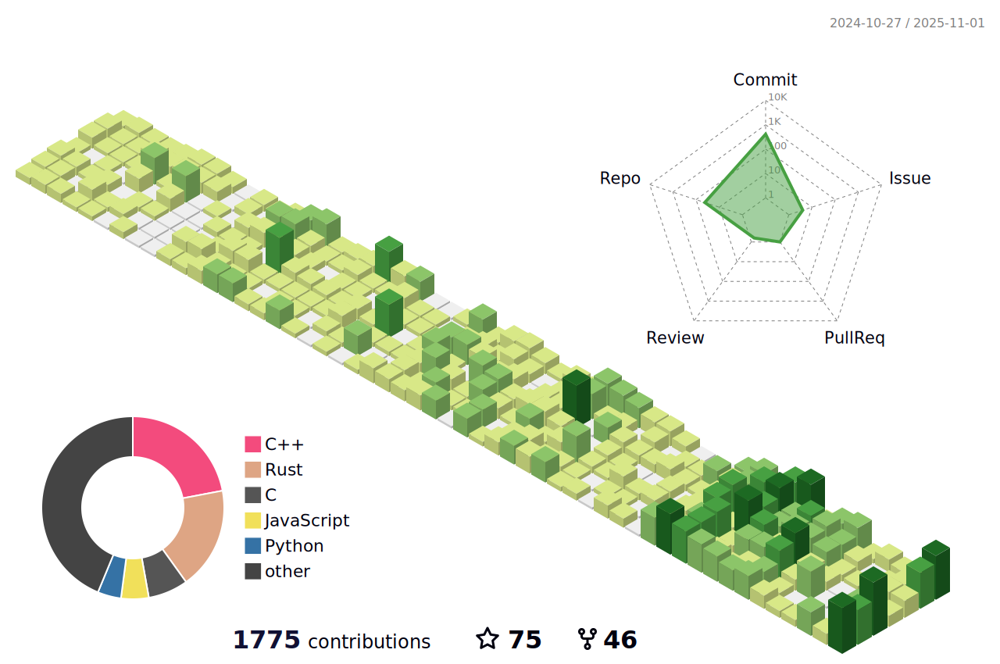

<p align="center">https://un4ckn0wl3z.dev</p>

<p align="center">
  <a href="https://discord.c99.nl/widget/theme-1/513528192297074699.png">
  
</a>
</p>

###  A little more about me...  
```csharp
string[] un4ckn0wl3z = new string[] { 
  "Code : JS/TS(Express/Nest.js), Java(SpringBoot),
          C#, Python, C++(Win32/Driver), IA32-Assembly, Go, Lua,
          Dart(Flutter), Rust(Tokio/Actix/egui/Slint), DearImGui(C++/GLFW),
          RayLib(C++), Qt(Pyside6), Qt(C++), ATL/WTL, MFC, Next.js ,
          Vue, TailwindCSS, Arduino C++,
          Verilog HDL (Design and Verification)", 
  "Tools : VS, VSCode, Docker, x64dbg, IDA, CE, Github, VMWare, KiCad, PlatformIO, cmake, cargo", 
  "Architecture : Win10, Linux", 
  "Interest : Science, Psychedelic Substances,
              Software Development, User/Kernel Mode cheat development,
              UEFI, Hypervisor development (Blue-Pill), DMA Cheat, IT Security, DevOps, Reverse Code Engineer,
              Binary analysis, Offensive tools development, Electronics, ML/AI,
              Analog Circuit/Digital Circuit and Design, PCB Design,
              Embedded System (FPGA/Microcontroller), Game Development,
              Software-Defined Radio (SDR)",
  "Hardware: Arduino, ESP8266, ESP32, RPi, Tang FPGA",
  "Firmware Stack: Arduino, FreeRTOS, ESP-IDF, MicroPython",
  "Not interested : Politic, Religion, Social media",
  "Hobbies : Play Chess, Checkers, Movies ripper",
  "Quote": "If you only do what you can do, you will never be more than you are now! - Kung Fu Panda" 
};
```

###  My hobby projects...(OSS and Private)

## Software

<a href="https://youtu.be/UVjtFZAcLVY" target="_blank">How to Become an Expert Hacker in 3 Minutes! <br>
<a href="https://github.com/un4ckn0wl3z/OPSEC" target="_blank">OPSEC Guide</a> : Best OPSEC Practice for Hackers!<br>
<a href="https://github.com/Pattaya-Project" target="_blank">Pattaya RAT</a> | Custom Websocket based C&C Server: https://youtu.be/Ht4GMrWczVo <br>
<a href="https://github.com/un4ckn0wl3z/CellRAT" target="_blank">Cell RAT</a> | Private Oldschool C# RAT style (TCP Based): https://youtu.be/kv9rhE_dErw <br>
Project FoodChain (RESTful based C2/Infostealer) : https://www.youtube.com/watch?v=43oqT2RRvOU <br>
CS2 External Cheats : https://www.youtube.com/playlist?list=PLHJN3wnSUAtmOylCII26_bKa7-FiCKvcW <br>
YOLOv11 AI Aimbot : https://youtu.be/JKWqLiwB0Lk <br>
<a href="https://github.com/un4ckn0wl3z/HerculesAC.git" target="_blank">HerculesAC (An experimental anti-cheat system for reversing and programming research.)</a>: https://www.youtube.com/playlist?list=PLHJN3wnSUAtk3aiAo9nyRf0ohcI8O6yRc <br>
Custom Cheat Engine Kernel Driver : https://youtu.be/xGPGfl3-ofQ <br>
<a href="https://github.com/un4ckn0wl3z/SimpleHypervisor.git" target="_blank">[SimpleHypervisor] Intel VT-x Hypervisor</a> : https://youtu.be/PfZ-Tbojc4A <br>
<a href="https://github.com/un4ckn0wl3z/unkhv.git" target="_blank">[unkhv] Hypervisor with EPT Stealth Hook </a> :  https://youtu.be/yaRPUJy5r1I <br>
[Protection Modder] - Kernel-Mode tool for modification process protection : https://www.youtube.com/watch?v=ZxGrrc1tbV0 <br>
[Process Unlinker] - Kernel-Mode tool for hiding Windows process : https://www.youtube.com/watch?v=B72OrC2VXuo <br>
[uProcessHide] - usermode process hider : https://youtu.be/KsJ2NnonY7Y <br>
[Anti-Launch] - Kernel-Mode tool for prevent target process running on system : https://youtu.be/F1Grbz-1abk <br>
<a href="https://github.com/un4ckn0wl3z/still-run-pb" target="_blank">PointBlank MoMzGames license patcher</a> : https://www.youtube.com/watch?v=4wwEld2qRuE <br>
FUD Chrome cookie stealer : https://www.youtube.com/watch?v=fwR7RWyJPJQ <br>
<a href="https://github.com/un4ckn0wl3z/classic_dll_injector_masm64" target="_blank">Classic CreateRemoteThread DLL Injector Rewrite in MASM64</a><br>
private FUD proxy Crypter : https://www.youtube.com/watch?v=WMhjvl57cH0 <br>
private FUD native Crypter : https://www.youtube.com/watch?v=IyNWpq6jefI <br>
<a href="https://github.com/un4ckn0wl3z/CSO2-Launcher-fixed" target="_blank">Crack fixed Private CSO2 Launcher for extended features<br></a>
Noob Layer 7 Stresser : https://www.youtube.com/watch?v=aifo1TaPRnE <br>
Noob Layer 4 Spoofer : https://www.youtube.com/watch?v=azGOYJXu4mU <br>
<a href="https://github.com/un4ckn0wl3z/AssaultCubeTrainerQT" target="_blank">Simple QT based/C++ Game Trainer (AssaultCube)</a>: https://youtu.be/gLlDuhzgrBA <br>
<a href="https://github.com/un4ckn0wl3z/HappyBeepDay" target="_blank">HappyBeepDay - Simple MASM64 Application for playing HBD song using Beep API </a><br>
<a href="https://github.com/un4ckn0wl3z/ShellcodeInjector" target="_blank">ShellcodeInjector - DLL Injection via Thread Ctx Hijacked Method </a><br>
<a href="https://github.com/un4ckn0wl3z/ThreadPriorityBoosterDrv" target="_blank">ThreadPriorityBoosterDrv - Kernel Thread Priority Booster </a><br>
<a href="https://github.com/un4ckn0wl3z/Labubot" target="_blank">Labubot - Popmart Automate Script </a><br>
<a href="https://github.com/un4ckn0wl3z/vmm-api-based.git" target="_blank">vmm-api-based - MemProcFS VMM API boilerplate for DMA development</a><br>
<a href="https://github.com/un4ckn0wl3z/DMAInvoker.git" target="_blank">DMAInvoker - Tool use for probe DMA device by interacting with real process memory</a><br>
<a href="https://github.com/un4ckn0wl3z/TeleScan2coeGui.git" target="_blank">TeleScan2coeGui - DMA firmware creation utility for converting the .tlscan file to a .coe file</a><br>
<a href="https://github.com/un4ckn0wl3z/DMACheatEngineLoader.git" target="_blank">DMACheatEngineLoader: Enabling DMA support for Cheat Engine</a>: https://youtu.be/iiqf3pV-H38 <br>
<a href="https://github.com/un4ckn0wl3z/thin-notepad.git" target="_blank">Thin Notepad - Example Notepad cloned application using Qt (PySide6)</a><br>
<a href="https://github.com/un4ckn0wl3z/ProcessMonitorEx.git" target="_blank">ProcessMonitorEx - KernelMode Process Monitor</a> : https://www.youtube.com/watch?v=9wdySFx4Bfc <br>
<a href="https://github.com/un4ckn0wl3z/Pinball3D-DMA-Cheat.git" target="_blank">Pinball3D-DMA-Cheat - Example DMA Cheat for Pinball3D x64</a> : https://youtu.be/FMB-9BFjAhk <br>
<a href="https://github.com/un4ckn0wl3z/ia32OSDev.git" target="_blank">ia32OSDev - Simple OS </a> : https://youtu.be/YVaZPix21jQ<br>
<a href="https://github.com/un4ckn0wl3z/WinIpc.git" target="_blank">WinIpc - Various way to implement interprocess-communication on Windows </a><br>
<a href="https://github.com/un4ckn0wl3z/WinsockImpl.git" target="_blank">WinsockImpl - Example Windows Sockets 2 implementation </a><br>
<a href="https://github.com/un4ckn0wl3z/PCIE-Detector.git" target="_blank">PCIE-Detector - Sample/PoC Windows kernel driver for detect DMA devices by using Vendor ID and Device ID signatures</a> : https://youtu.be/DGPBm780Uag<br>
<a href="https://github.com/un4ckn0wl3z/ALU.git" target="_blank">ALU: Example digital ALU using Verilog<br>
<a href="https://github.com/un4ckn0wl3z/verilog-traffic-light-control-mealy-fsm.git" target="_blank">FPGA Traffic Light Control (Mealy FSM)<br>
<a href="https://github.com/un4ckn0wl3z/Arduino_Sketchs.git" target="_blank">My useful Arduino Sketches<br>
<a href="https://github.com/un4ckn0wl3z/Cyclone-IV-FPGA-2-bit-adder-to-7-segment.git" target="_blank">Cyclone IV FPGA | 2 bit adder to 7 segment<br>
<a href="https://github.com/un4ckn0wl3z/Verilog-Labs.git" target="_blank">My useful Verilog HDL Code<br>
<a href="https://github.com/un4ckn0wl3z/MemMCP.git" target="_blank">MemMCP - Cheat Engine-like but MCP<br>
<a href="https://github.com/un4ckn0wl3z/remote-dll-injector-zig.git" target="_blank">remote-dll-injector-zig - Zig DLL Injector<br>
<a href="https://github.com/un4ckn0wl3z/pvz-trainer-rs.git" target="_blank">pvz-trainer-rs - Sample +4 Trainer for Plants vs Zombies, developed in Rust<br>
<a href="https://github.com/un4ckn0wl3z/pvz-trainer-slint.git" target="_blank">pvz-trainer-slint - Same trainer as above but rewrite gui using Slint<br>
<a href="https://github.com/un4ckn0wl3z/title-randomizer-rs.git" target="_blank">title-randomizer-rs - Windows Title Randomizer<br>
<a href="https://github.com/un4ckn0wl3z/rapidgator-downloader-rs.git" target="_blank">rapidgator-downloader-rs - The fastest Rapidgator premium account downloader written in Rust<br>
<a href="https://github.com/un4ckn0wl3z/LuaInteropDemo.git" target="_blank">Custom LUA VM Demo - Call C-ABI/FFI via Lua Script<br>
<a href="https://github.com/un4ckn0wl3z/i386-emulator.git" target="_blank">i386-emulator - An experimental i386 CPU Real Mode Emulator<br>
<a href="https://github.com/un4ckn0wl3z/asmtryer.git" target="_blank">Yet Another Shellcode Injector / Thread Hijacking Tool and Assembler playground<br>
<a href="https://github.com/un4ckn0wl3z/web-archive-toolkit.git" target="_blank">web-archive-toolkit | utilities for web archive<br>
<a href="https://github.com/un4ckn0wl3z/Stewardkeylogger.git" target="_blank">Steward KL - Research Purpose Keylogger<br>
<a href="https://github.com/un4ckn0wl3z/PointerLookup.git" target="_blank">PointerLookup - CE-Likes Pointer Lookup<br>


Free public torrent tracker : (<b>Under Maintenance</b>) <br>
<a href="https://github.com/micro-sms-spoofer" target="_blank">MicroSMS Spoofer</a> | Free SMS Spoofer : (<b>Under Maintenance</b>) <br>

## Games & Computer Graphics
<a href="https://github.com/un4ckn0wl3z/2dgameengine.git" target="_blank">2D C++ Game Engine (ECS Architecture)<br>
<a href="https://github.com/un4ckn0wl3z/2dphysics-engine.git" target="_blank">2dphysics-engine (Experimental physics engine for 2D space)<br>

## Hardware
<a href="https://github.com/un4ckn0wl3z/WiFi_Frauder_DEV.git" target="_blank"> WiFi Frauder - ESP32 WiFi Troller PCB + Firmware<br>


